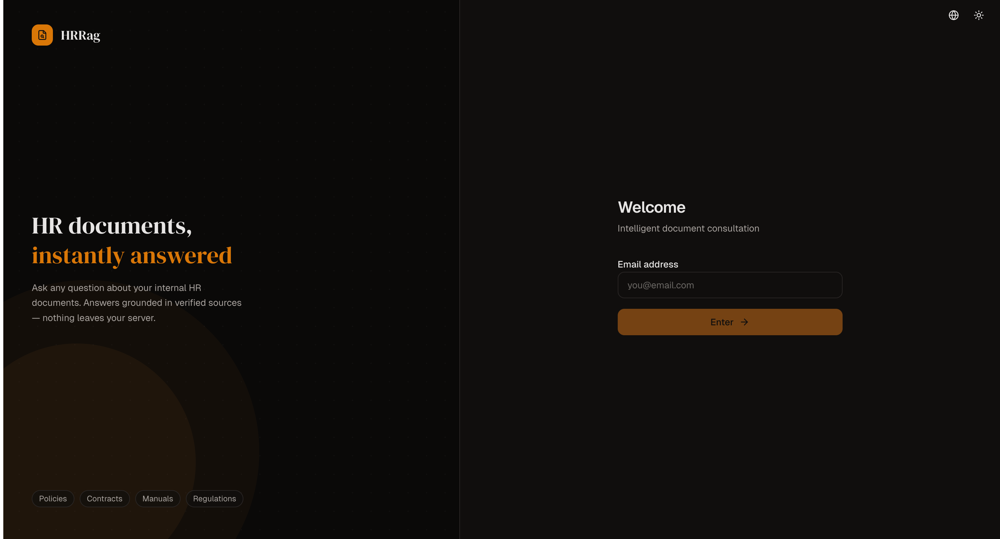
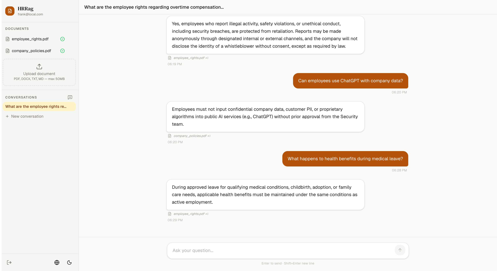

# HRRag

**How do I ask questions about our internal HR documents without sending them to a cloud?**

HRRag is a self-hosted conversational RAG (Retrieval-Augmented Generation) platform that lets employees query internal HR documents — policies, contracts, regulations, manuals — using plain natural language. Every component runs locally: the database, the embedding model, and the LLM. No document, query, or answer ever leaves your server.

---

## Screenshots

<details>
<summary>Login page (dark mode)</summary>



</details>

<details>
<summary>Chat — querying an HR document</summary>



</details>

---

## What problem does it solve?

HR teams maintain large bodies of documents (labor contracts, internal regulations, benefits policies, onboarding guides) that employees struggle to search. Traditional keyword search fails when the question uses different vocabulary than the document. Sending documents to external AI APIs raises confidentiality concerns.

HRRag answers questions like:
- "How many vacation days do I get after my first year?"
- "What is the disciplinary process for repeated absences?"
- "Does the contract cover remote work expenses?"

…by finding the exact passage, showing the source and page number, and generating a grounded answer — all on-premise.

---

## Architecture

```
┌─────────────────────────────────────────────────────────┐
│  Browser (React 19 + Vite)                              │
│  • Chat UI with SSE streaming                           │
│  • Document upload & status tracking                    │
│  • EN/ES i18n, dark/light theme                        │
└───────────────────────┬─────────────────────────────────┘
                        │ HTTP / SSE
┌───────────────────────▼─────────────────────────────────┐
│  Backend (FastAPI + Python)                             │
│  • REST API + JWT auth (email-only, no passwords)       │
│  • Document ingestion pipeline (async background task)  │
│  • Hybrid RAG retrieval pipeline                        │
│  • Streaming LLM responses via Ollama                   │
└──────────┬────────────────────────┬─────────────────────┘
           │                        │
┌──────────▼──────────┐   ┌─────────▼───────────────────┐
│  PostgreSQL 17      │   │  Ollama (host-native)        │
│  + pgvector         │   │  • qwen2.5:14b  (LLM)       │
│                     │   │  • nomic-embed-text          │
│  • Users            │   │    (embeddings, 768 dims)    │
│  • Documents        │   └─────────────────────────────┘
│  • DocumentChunks   │
│    (HNSW cosine)    │
│  • ChatSessions     │
│  • ChatMessages     │
└─────────────────────┘
```

All models run via **Ollama on the host** — no Docker container needed for inference. CPU inference works; a GPU significantly reduces response latency.

---

## Key processes

### 1. Document ingestion — parent-child chunking

When a document is uploaded, text extraction and embedding happen in an async background task (the HTTP response returns immediately):

```
Upload → Extract text (PDF / DOCX / TXT / MD)
       → Split into parent chunks (~2000 words, 100-word overlap)
       → Split each parent into child chunks (~400 words, 50-word overlap)
       → Embed children via nomic-embed-text (768-dim vectors)
       → Store in PostgreSQL — parents without embedding, children with HNSW index
```

**Why two levels?** Small children produce precise embeddings for retrieval; large parents give the LLM enough surrounding context to answer accurately. Without this, a 400-word chunk can lack the context needed to understand what the relevant sentence actually means.

### 2. Retrieval pipeline — HyDE + hybrid search

Every user question goes through a multi-step pipeline before reaching the LLM:

```
User question
  │
  ├─ HyDE: generate a hypothetical document excerpt (Ollama, temp 0.3)
  ├─ Query rewrite: generate 3 formal search variants (Ollama, temp 0.5)
  │   (both run in parallel)
  │
  ├─ Embed: [original query] + [HyDE] + [3 rewrites] → up to 5 vectors
  │         all prefixed "search_query:" (nomic asymmetric model requirement)
  │
  ├─ Vector search: parallel pgvector cosine search per vector → merge pool
  │   hit_count = how many searches returned this chunk
  │   best_vec_score = highest cosine similarity across all searches
  │
  ├─ Full-text search: tsvector 'simple' (language-agnostic) on all variants
  │
  ├─ Unified score: hit_norm×0.5 + vec_score×0.3 + fts_norm×0.2
  ├─ Dynamic threshold: mean − 1.5×std (floor at min_similarity×0.5)
  │
  └─ Fetch parent chunks → build context block → send to LLM
```

**Why HyDE?** Users ask in colloquial language ("how many days for a wedding?") but HR documents use formal vocabulary ("marriage leave entitlement"). HyDE generates a formal hypothesis that lands closer to the right passage in embedding space.

**Why hybrid?** Vector search handles synonyms and paraphrases; full-text handles exact terms (article numbers, codes, dates). The combination covers most HR document retrieval patterns without hardcoded vocabulary.

**Why the `search_query:` prefix?** `nomic-embed-text` is an asymmetric model trained with separate prefixes for queries and documents. Omitting the prefix on queries produces poor cosine similarity against document embeddings — this was the single biggest retrieval quality fix in this project.

### 3. Streaming answer generation

After retrieval, the LLM receives a prompt in the user's language (EN or ES) containing:
- A strict instruction to answer only from the provided excerpts
- The parent-chunk context blocks, labeled with source file and page number
- The last 3 turns of conversation history
- The current question

Tokens are streamed back via SSE as they are generated. On completion, source citations (document name, page, excerpt) are sent in a final `done` event and displayed below the answer.

---

## Repository structure

```
HRRag/
├── Makefile                    ← all common commands (run from repo root)
├── README.md                   ← this file
├── backend/
│   ├── docker-compose.yml      ← PostgreSQL + pgvector (only external dependency)
│   ├── .env.example            ← environment variable template
│   ├── README.md               ← API reference, DB schema, pipelines, env vars
│   └── app/
│       ├── auth/               ← email-only JWT auth
│       ├── documents/          ← upload, ingestion, chunking, embedding
│       ├── chat/               ← sessions, messages, retrieval, streaming
│       └── core/               ← config, DB engine, security, embeddings
└── frontend/
    ├── README.md               ← stack, component map, i18n guide, SSE flow
    └── src/
        ├── pages/              ← LoginPage, ChatPage
        ├── components/         ← layout, chat, documents
        ├── store/              ← auth, chat, theme (Zustand)
        ├── hooks/              ← TanStack Query wrappers
        └── locales/en|es/      ← i18n strings
```

For deeper detail on each component, see the dedicated READMEs:

- [backend/README.md](backend/README.md) — API reference, DB schema, full pipeline internals, all environment variables
- [frontend/README.md](frontend/README.md) — component map, i18n guide, SSE streaming flow, state management

---

## Quick start

**Requirements:** Docker, [Ollama](https://ollama.com), Node.js ≥ 20, [uv](https://docs.astral.sh/uv/).

### 1. Pull Ollama models

```bash
ollama pull qwen2.5:14b
ollama pull nomic-embed-text
```

### 2. First-time setup

```bash
make setup
# Creates backend/.env from backend/.env.example and installs all dependencies.
# Edit backend/.env — at minimum set SECRET_KEY (min 32 chars).
```

### 3. Run services (three separate terminals)

```bash
make db        # PostgreSQL on port 5432 (Docker, background)
make backend   # FastAPI on :8000
make frontend  # React + Vite on :5173
```

```bash
make help      # list all available commands
```

| URL | Description |
|---|---|
| http://localhost:5173 | Web app |
| http://localhost:8000/docs | Swagger API explorer |

---

## Environment variables

All variables live in `backend/.env` (copy from `backend/.env.example`).

| Variable | Required | Description |
|---|---|---|
| `SECRET_KEY` | ✓ | JWT signing key — min 32 characters |
| `OLLAMA_MODEL` | | LLM model name. Default: `qwen2.5:14b` |
| `OLLAMA_EMBEDDING_MODEL` | | Embedding model. Default: `nomic-embed-text` |
| `OLLAMA_BASE_URL` | | Default: `http://localhost:11434` |
| `POSTGRES_PASSWORD` | | Must match `docker-compose.yml`. Default: `hrrag` |

See [backend/README.md](backend/README.md) for the full variable reference.

---

## License

GNU General Public License v3.0 — see [LICENSE](LICENSE) for details.
